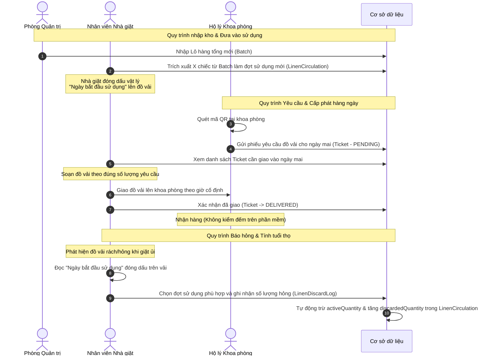

# Thiết kế Hệ thống Quản lý và Phân phối Đồ vải Bệnh viện (Linen Management System)

Tài liệu này đặc tả thiết kế kiến trúc, cơ sở dữ liệu và quy trình vận hành của Hệ thống quản lý và phân phối đồ vải từ nhà giặt đến các khoa phòng bệnh viện.

## 1. Mục tiêu hệ thống
* **Quản lý tồn kho tổng:** Theo dõi các lô hàng đồ vải nhập về bệnh viện do Phòng Quản trị thực hiện.
* **Theo dõi vòng đời sử dụng (Vòng đời đồ vải):** Cho phép nhà giặt trích xuất đồ vải từ lô tổng, gắn ngày bắt đầu sử dụng (đóng dấu vật lý) để lưu hành.
* **Đặt hàng hàng ngày qua QR Code:** Hộ lý quét mã QR tại khoa phòng để gửi yêu cầu cấp phát đồ vải một cách nhanh chóng mà không cần đăng nhập phức tạp.
* **Phân phối nhanh gọn:** Nhà giặt chuẩn bị đồ và giao lên khoa phòng vào ngày hôm sau theo giờ cố định, xác nhận hoàn thành trên phần mềm mà không cần đối soát đếm nhận phức tạp (giảm thiểu thao tác của nhân sự).
* **Thống kê hư hỏng & tuổi thọ:** Theo dõi lượng đồ vải hư hỏng dựa theo ngày bắt đầu sử dụng để tính tuổi thọ trung bình của từng đợt đồ vải.

---

## 2. Công nghệ sử dụng (Tech Stack)
* **Framework:** Next.js (App Router, TypeScript)
* **ORM:** Prisma ORM
* **Database:** PostgreSQL
* **Styling:** Vanilla CSS (hoặc Tailwind CSS tùy chọn khi cài đặt)
* **Xác thực và Phân quyền:** JWT (JSON Web Token) cho Nhân viên Quản trị & Nhà giặt. URL signed-token để định danh Khoa phòng khi quét mã QR.

---

## 3. Kiến trúc Cơ sở dữ liệu (Database Schema)

Dưới đây là các bảng dữ liệu được định nghĩa bằng ngôn ngữ Prisma Schema:

```prisma
datasource db {
  provider = "postgresql"
  url      = env("DATABASE_URL")
}

generator client {
  provider = "prisma-client-js"
}

// Vai trò người dùng trong hệ thống
enum Role {
  ADMIN       // Phòng Quản trị
  LAUNDRY     // Nhân viên Nhà giặt
}

// Trạng thái phiếu yêu cầu cấp phát
enum TicketStatus {
  PENDING     // Hộ lý đã gửi yêu cầu, chờ giao
  DELIVERED   // Nhà giặt đã giao hàng thành công (hoàn thành)
}

// 1. Tài khoản nhân viên (Quản trị & Nhà giặt)
model User {
  id           String   @id @default(uuid())
  username     String   @unique
  passwordHash String
  role         Role     @default(LAUNDRY)
  createdAt    DateTime @default(now())
}

// 2. Danh mục Loại đồ vải (Ga giường, áo mổ, vỏ gối...)
model LinenType {
  id          String              @id @default(uuid())
  name        String              @unique // Ví dụ: Ga giường 1m2, Áo bệnh nhân
  unit        String              // Đơn vị tính: Cái, Bộ...
  batches     Batch[]
  circulations LinenCirculation[]
  ticketItems TicketItem[]
  createdAt   DateTime            @default(now())
}

// 3. Lô hàng nhập tổng (Do Phòng Quản trị nhập)
model Batch {
  id                String             @id @default(uuid())
  code              String             @unique // Mã lô hàng, ví dụ: LÔ-2026-06-A
  linenTypeId       String
  linenType         LinenType          @relation(fields: [linenTypeId], references: [id])
  totalQuantity     Int                // Số lượng nhập ban đầu
  remainingQuantity Int                // Số lượng còn lại trong kho tổng chưa trích
  importedAt        DateTime           // Ngày nhập lô hàng
  createdAt         DateTime           @default(now())
  circulations      LinenCirculation[]
}

// 4. Đợt đưa vào sử dụng thực tế (Do Nhà giặt trích từ Batch và đóng dấu ngày bắt đầu)
model LinenCirculation {
  id                String             @id @default(uuid())
  batchId           String
  batch             Batch              @relation(fields: [batchId], references: [id])
  linenTypeId       String
  linenType         LinenType          @relation(fields: [linenTypeId], references: [id])
  startUseDate      DateTime           // Ngày bắt đầu sử dụng (đóng dấu trên vải)
  originalQuantity  Int                // Số lượng trích ra sử dụng ban đầu
  activeQuantity    Int                // Số lượng còn đang lưu hành thực tế (original - discarded)
  discardedQuantity Int                @default(0) // Số lượng hỏng/thải bỏ
  createdAt         DateTime           @default(now())
  discardLogs       LinenDiscardLog[]
}

// 5. Nhật ký ghi nhận hư hỏng/thải bỏ (Do Nhà giặt nhập dựa trên ngày đóng dấu)
model LinenDiscardLog {
  id                 String           @id @default(uuid())
  linenCirculationId String
  circulation        LinenCirculation @relation(fields: [linenCirculationId], references: [id])
  quantity           Int              // Số lượng hỏng loại bỏ
  reason             String?          // Lý do: rách, ố mốc, quá hạn sử dụng...
  loggedAt           DateTime         @default(now()) // Ngày ghi nhận hỏng
}

// 6. Khoa phòng bệnh viện
model Ward {
  id          String   @id @default(uuid())
  name        String   @unique // Ví dụ: Khoa Ngoại, Khoa Cấp cứu
  qrToken     String   @unique // Token bảo mật riêng biệt nhúng vào URL QR Code
  tickets     Ticket[]
  createdAt   DateTime @default(now())
}

// 7. Phiếu yêu cầu cấp phát đồ vải hàng ngày (Do Hộ lý tạo)
model Ticket {
  id           String       @id @default(uuid())
  wardId       String
  ward         Ward         @relation(fields: [wardId], references: [id])
  status       TicketStatus @default(PENDING)
  deliveryDate DateTime     // Ngày giao hàng dự kiến (mặc định là ngày hôm sau)
  createdAt    DateTime     @default(now())
  items        TicketItem[]
}

// 8. Chi tiết phiếu yêu cầu cấp phát đồ vải
model TicketItem {
  id          String    @id @default(uuid())
  ticketId    String
  ticket      Ticket    @relation(fields: [ticketId], references: [id], onDelete: Cascade)
  linenTypeId String
  linenType   LinenType @relation(fields: [linenTypeId], references: [id])
  quantity    Int       // Số lượng hộ lý yêu cầu (Nhà giặt mặc định giao đủ số này)
}
```

---

## 4. Luồng Nghiệp vụ & Vận hành



### Chi tiết các bước:

#### Bước 1: Quản trị nhập lô hàng ban đầu (Phòng Quản trị)
* Nhân viên Phòng Quản trị đăng nhập vào phân hệ `/admin`.
* Tạo mới hoặc chọn Loại đồ vải (`LinenType`).
* Nhập lô hàng mới (`Batch`): nhập Mã lô, chọn Loại đồ vải, Số lượng nhập và Ngày nhập kho.

#### Bước 2: Đưa đồ vải vào lưu hành (Nhà giặt)
* Nhân viên Nhà giặt đăng nhập vào phân hệ `/laundry`.
* Chọn một lô hàng tổng còn tồn kho (`Batch.remainingQuantity > 0`).
* Nhập số lượng trích xuất (ví dụ: trích 300 chiếc ga giường từ lô 1000 chiếc) và chọn **Ngày bắt đầu sử dụng** (ví dụ: ngày hôm nay 09/06).
* Hệ thống sẽ tự động trừ `remainingQuantity` của `Batch` và tạo ra bản ghi `LinenCirculation` mới.
* Nhân viên nhà giặt tiến hành đóng dấu mực chuyên dụng ngày bắt đầu sử dụng (ví dụ: "Sử dụng: 09/06/2026") lên mép các tấm đồ vải đó trước khi phân phối.

#### Bước 3: Hộ lý gửi yêu cầu hàng ngày qua QR Code
* Tại mỗi khoa phòng sẽ dán cố định một mã QR chứa đường dẫn định danh:
  `https://laundry.hospital.vn/request/order?wardId={WARD_ID}&token={QR_TOKEN}`
* Hộ lý dùng điện thoại quét mã QR này vào giờ cố định mỗi ngày.
* Hệ thống Next.js kiểm tra tính hợp lệ của `{QR_TOKEN}` tương ứng với `{WARD_ID}` trong database.
* Nếu hợp lệ, hệ thống hiển thị trực tiếp form yêu cầu cấp phát cho khoa tương ứng (không bắt đăng nhập).
* Hộ lý chọn Loại đồ vải và nhập Số lượng cần cấp phát cho ngày hôm sau, bấm "Gửi yêu cầu".
* Hệ thống tạo một phiếu `Ticket` ở trạng thái `PENDING`, với ngày nhận hàng dự kiến `deliveryDate` là ngày tiếp theo.

#### Bước 4: Nhà giặt soạn đồ và giao hàng (Không kiểm đếm)
* Nhân viên Nhà giặt truy cập màn hình điều hành, lọc các Ticket có trạng thái `PENDING` và ngày giao là hôm nay/ngày mai.
* Hệ thống hỗ trợ gom tổng hợp số lượng theo loại đồ vải để nhà giặt chuẩn bị nhanh (ví dụ: Tổng ga giường cần giao toàn viện hôm nay là 200 chiếc).
* Nhân viên xếp đồ lên xe và đi giao tới các khoa phòng theo giờ cố định.
* Giao xong, nhân viên nhà giặt truy cập phần mềm và bấm nút **"Xác nhận đã giao"** cho từng khoa phòng. Trạng thái ticket chuyển thành `DELIVERED`. 
* Hệ thống mặc định hiểu số lượng giao đúng bằng số lượng yêu cầu, không yêu cầu hộ lý phải đăng nhập để xác nhận nhận hàng hoặc đếm đối soát trên phần mềm nhằm tiết kiệm thời gian của cả 2 bên.

#### Bước 5: Báo hỏng và thống kê tuổi thọ đồ vải (Nhà giặt)
* Trong quá trình thu gom và giặt là, nếu phát hiện đồ vải bị hư hỏng (rách, ố mốc nặng không thể tẩy, mòn quá tiêu chuẩn), nhân viên nhà giặt sẽ phân loại riêng.
* Họ kiểm tra vết dấu đóng trên đồ vải để xem chiếc đó bắt đầu sử dụng từ ngày nào.
* Trên phần mềm, nhân viên chọn đợt lưu hành tương ứng (`LinenCirculation`) và nhập Số lượng bị hỏng loại bỏ cùng Lý do hỏng.
* Hệ thống ghi nhận vào bảng `LinenDiscardLog` và cập nhật giảm `activeQuantity` của đợt lưu hành đó.
* **Báo cáo Tuổi thọ:** Hệ thống tính toán thời gian chênh lệch giữa ngày báo hỏng (`loggedAt`) và ngày bắt đầu sử dụng (`startUseDate`) của đợt đó để vẽ biểu đồ thống kê tuổi thọ trung bình của đồ vải theo từng lô hàng, giúp Phòng Quản trị đánh giá chất lượng của nhà cung cấp đồ vải.

---

## 5. Thiết kế Giao diện (UI Components)

Hệ thống sẽ được xây dựng với các màn hình chính sau:

### Phân hệ Mobile (Dành cho Hộ lý các Khoa)
* **Trang tạo yêu cầu nhanh (`/request/order`):**
  * Tự động hiển thị tên khoa (ví dụ: "Yêu cầu đồ vải - KHOA CẤP CỨU").
  * Danh sách chọn loại đồ vải trực quan kèm nút tăng giảm số lượng nhanh (+ / -).
  * Nút "Gửi yêu cầu" nổi bật ở phía dưới.
  * Màn hình thông báo gửi thành công kèm thời gian nhận hàng dự kiến.

### Phân hệ Desktop / Tablet (Dành cho Nhà giặt & Phòng Quản trị)
* **Màn hình Quản trị viên (`/admin`):**
  * Quản lý Danh mục Khoa phòng & Xuất mã QR Code định danh của từng khoa để in dán.
  * Quản lý Danh mục Loại đồ vải.
  * Quản lý Nhập lô hàng tổng (`Batch`).
* **Màn hình Nhà giặt (`/laundry`):**
  * **Tab Cấp phát:** Hiển thị danh sách yêu cầu cần giao hôm nay từ các khoa phòng. Gom nhóm tổng hợp số lượng đồ vải cần soạn. Có nút bấm một chạm "Xác nhận đã giao".
  * **Tab Kho lưu hành:** Nơi trích xuất lô hàng tổng thành đợt sử dụng vật lý mới.
  * **Tab Báo hỏng:** Nhập số lượng đồ vải bị loại bỏ dựa trên ngày bắt đầu sử dụng ghi trên vải.
  * **Tab Báo cáo:** Biểu đồ hiển thị tuổi thọ trung bình của đồ vải, tỷ lệ hao hụt của từng lô hàng theo thời gian.
